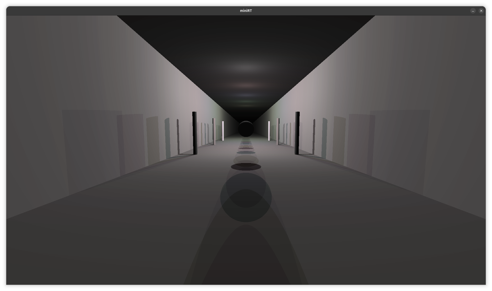
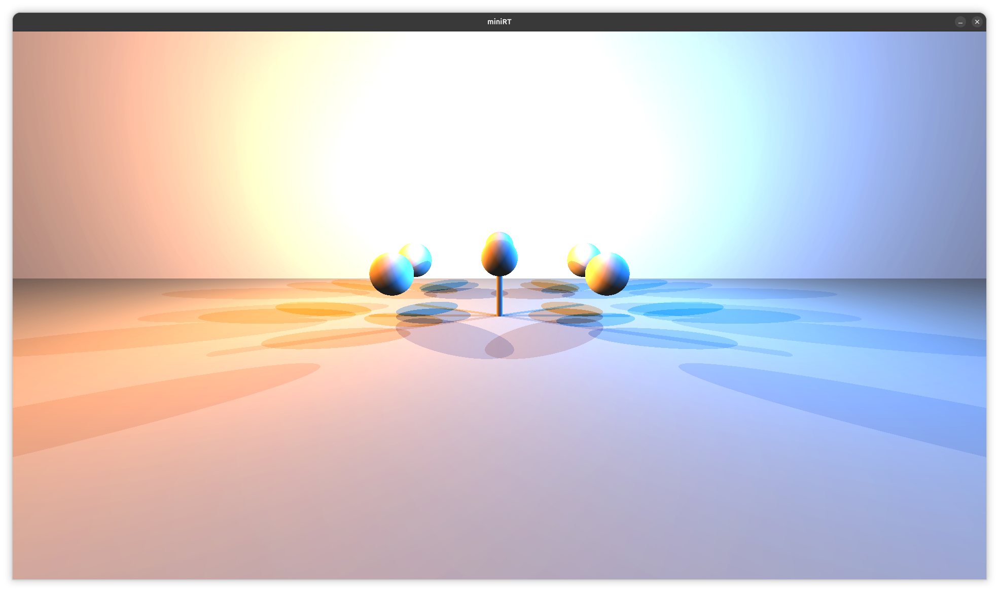
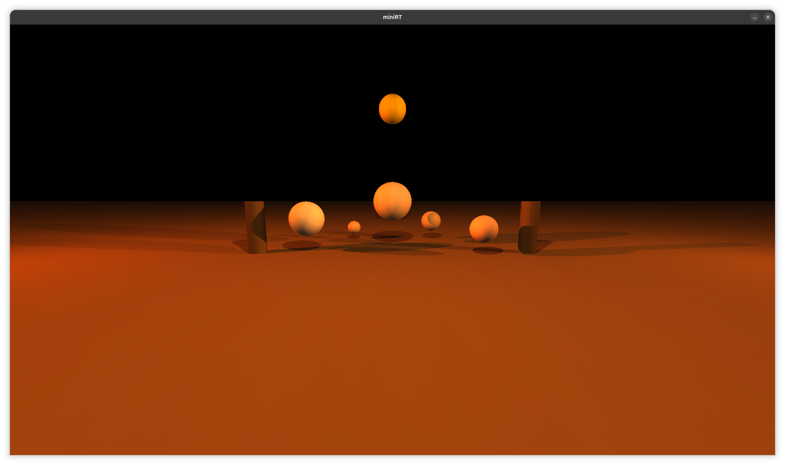

# *miniRT*

Developed by [@MikAghumyan](https://github.com/MikAghumyan) and [@cppapooparot](https://github.com/cppapooparot)

## 💡 Overview

*miniRT* is a simple 3D ray tracer written in C as part of the [42 school](https://github.com/42school) curriculum, designed to render basic scenes with spheres, planes, and cylinders.

## 🖥️ Demo






## ⚙️ Features
- **Basic Shapes**: Support for spheres, planes, and cylinders.
- **Lighting**: Basic lighting model with ambient, diffuse, and specular components.
- **Camera Control**: Simple camera setup for viewing the scene.
- **Scene Description**: Scene configuration through a custom file format.
- **Error Handling**: Robust error handling for invalid inputs and edge cases.
	
## 🧰 Prerequisites

### 🧱 System Requirements
+ Operating System: Linux (tested on Ubuntu 22.04 – 25.10)
+ Architecture: tested on x86_64
+ Compiler: **clang19** (recommended)
  - ⚠️ **Important**: MiniLibX does not work properly with newer versions of GCC and Clang. Clang19 is recommended for compatibility.

### ⚙️ Install Dependencies (Ubuntu/Debian)
``` bash
sudo apt update
sudo apt install build-essential clang-19 libx11-dev libxext-dev libbsd-dev
```

## 💽 Installation
```bash
git clone --recursive https://github.com/MikAghumyan/miniRT.git
cd miniRT
make
```

## 💡Acknowledgments

- **[42 school](https://github.com/42school)**: For providing the project framework and resources.
- **Community**: Thanks to peers for providing assistance and sharing knowledge.
- [@42school](https://github.com/42school) [@42paris](https://github.com/42paris) [@jesuismarie](https://github.com/jesuismarie) [@mansargs](https://github.com/mansargs) [@assam4](https://https://github.com/assam4)